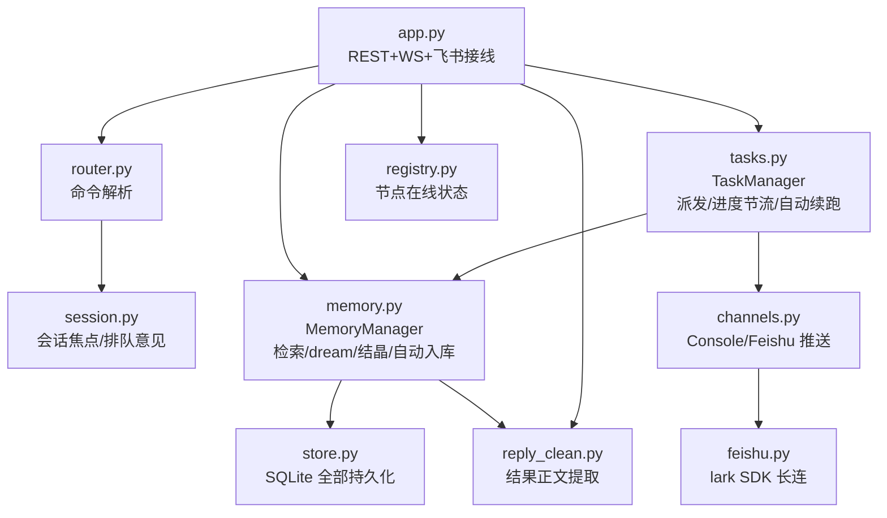

# Agent Fabric 代码图谱（CODE_GRAPH）

> 给人和 agent 的导航地图。改结构时同步更新本文档。
> 生成于 2026-09-06 · V0.11 · 46 tests

## 1. 拓扑总览

```
                Feishu 小八 (lark-oapi wss)          REST /api/* (curl/测试)
                        │                                 │
                        └──────────┬──────────────────────┘
                                   ▼
                     ┌─────────────────────────┐
                     │  central :8000          │   systemd fabric-central
                     │  FastAPI + ChannelHub   │
                     │  SQLite WAL (fabric.db) │◄─── fabric-dream.timer (每6h POST /api/dream)
                     └───────────┬─────────────┘
                                 │  af/1 · WS（节点出站长连）
              ┌──────────────────┼──────────────────┐
              ▼                  ▼                  ▼
        ┌──────────┐       ┌──────────┐       ┌──────────┐
        │ mapian   │       │ test-node│       │ (实验节点) │
        │ 麦片     │       │ 米线=本机 │       │  待接入    │
        │ mimo-free│       │ nemotron │       └──────────┘
        └──────────┘       └──────────┘
        每节点: fabric-node daemon + opencode CLI（免费模型）
```

## 2. 模块依赖图（central 侧）



## 3. 模块职责与关键函数

| 文件 | 职责 | 关键入口 |
|---|---|---|
| `central/app.py` | 唯一接线层：REST/WS/飞书 → 各管理器 | `create_app()`, `handle_user_text()` |
| `central/router.py` | 文本→命令对象（kind/goal/node） | `parse_command()` |
| `central/session.py` | V0.9 会话：焦点主机、别名、followup 队列 | `SessionManager.resolve()/switch()` |
| `central/tasks.py` | 任务生命周期；⏳进度节流(8s窗)；RESULT→自动续跑；internal 任务静默 | `create/dispatch/resume/cancel`, `_auto_followup` |
| `central/memory.py` | 记忆全部：混合检索、组包、dream、结晶蒸馏、自动入库、更正 | `search()`, `build_context_package()`, `dream()`, `crystallize()`, `auto_crystallize()`, `ingest_candidate()` |
| `central/store.py` | SQLite：tasks/events/memories/candidates，全写路径持锁 | `save_task`, `add_memory`, `review_memory_candidate` |
| `central/reply_clean.py` | opencode 输出→模型自然回复（fence/数字保全） | `extract_reply()` |
| `central/channels.py` | 推送多路：Console + Feishu | `hub.broadcast()` |
| `central/feishu.py` | 飞书长连适配（fail-safe，无凭据可运行） | `FeishuChannel` |
| `node/daemon.py` | 节点守护：WS 出站、outbox 重发、handoff 快照/恢复、LESSON 候选回流 | `FabricNode.run()`, `_emit_memory_candidate` |
| `node/adapters/opencode.py` | harness 适配：context_package→prompt 渲染（[项目知识][历史经验][可用技能]）+ LESSON 指令 | `_compose_prompt()` |
| `shared/protocol.py` | af/1 信封：T_TASK_START/PROGRESS/RESULT/MEMORY_CANDIDATE… | `P.make()` |

## 4. 一次自然语言任务的完整数据流

```
飞书文本 "用python画柱状图"
→ feishu.on_text → handle_user_text
→ parse_command → kind=unknown
→ session.focus 已选主机？ 否→"先选主机"；忙→followups 排队
→ tasks.create(goal) → memory.build_context_package(goal)★检索注入
→ T_TASK_START(ws) → 节点 daemon
→ adapter._compose_prompt：<context>…</context>+goal+[LESSON指令]
→ opencode run（免费模型）→ progress 行 ws 回传
→ central on_event → _push_progress_throttled（$命令行/工具行即时，8s窗聚合）
→ T_TASK_RESULT → reply_clean.extract_reply → ✅推送
→ memory.on_task_result（task流水） + daemon解析[LESSON]→候选
→ ingest_candidate：中性→自动入库+auto_crystallize；教训型→pending人审
```

## 5. 记忆数据流（闭环）

```
捕获: LESSON自标(模型) / memory add(人) / task流水(自动)
   ↓ 自动入库(中性) 或 review promote(教训型)
memories 表(kind/importance/hits/embedding)
   ↓ 检索 hits+1        ↓ dream(6h timer)
build_context_package    去重合并/流水限额/零命中降权
   ↓ 注入 prompt
任务执行 → 新LESSON → …（环闭合）
结晶支线: auto_crystallize(冷却1h+素材≥3+判重cos<0.85)
   → internal蒸馏任务(节点免费模型) → skill库 → 注入[可用技能]
人审补丁: memory edit(更正,向量重算) / memory forget(删) / review(教训型)
```

## 6. 测试地图（46 个）

| 文件 | 覆盖 |
|---|---|
| test_e2e.py | 单节点 REST 全链 + 候选自动入库 |
| test_handoff.py | 工作区快照/恢复/跨节点续跑 + 假 adapter(Make/ReadFile) |
| test_integration.py | 面板命令 E2E + crystallize 素材门槛 |
| test_memory_tiers.py | 三层注入渲染 + LESSON 指令 |
| test_hybrid_retrieval.py | BM25×向量融合、退化链、回填 |
| test_reply_clean.py | 正文提取（fence/货币/数字保全） |
| test_lesson.py | LESSON 解析 + 自动入库分流 + edit 更正 |
| test_dream_crystallize.py | dream 三招 + 蒸馏 fake/fallback + 自动判重 |
| test_review_flow.py | 教训型留审→promote→入库 |
| test_session_flow.py | use/自然语言/排队/自动续跑 E2E |
| conftest.py | cluster fixture（双节点进程内 + 预置 demo.txt） |

## 7. 部署拓扑对照

| 机器 | 跑什么 | 部署注意 |
|---|---|---|
| 本机(米线) | central + fabric-node-local | 代码在 /root/dsh-ws/agent-fabric |
| mapian(麦片) | fabric-node | **pip 装在 site-packages**，rsync 必须打 `.venv/lib/python3.10/site-packages/fabric/` |
| 飞书 | 小八（AF_FEISHU_ENABLED=1） | 小九 dsh 桥不许动 |

## 8. 版本里程碑

V0.5 handoff 续跑 → V0.6 三级记忆 → V0.7 混合检索 → V0.8 审核+结晶 → V0.9 会话化指挥 → V0.9.1 正文提取 → V0.9.2 LESSON 回流 → V0.10 dream+蒸馏 → V0.10.1 timer+自动结晶 → V0.11 自动入库+更正
（详见 TESTING.md 每轮记录；决策见 docs/DECISIONS.md）
